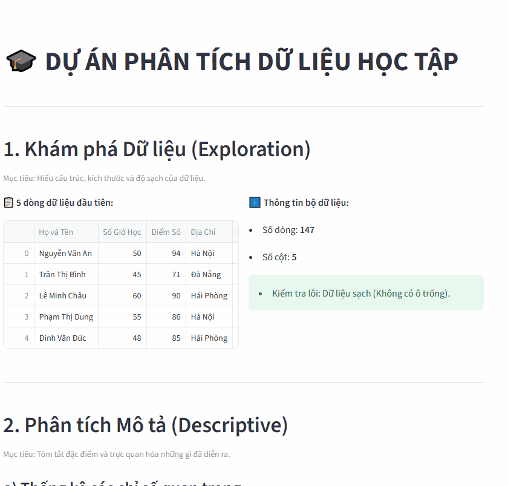

# 🎓 Student Performance Analytics Dashboard

## Demo:

  

## 📌 Tổng quan dự án (Overview)
Ứng dụng Web này được phát triển để cung cấp cái nhìn toàn diện về kết quả học tập của học sinh. Dự án không chỉ dừng lại ở việc hiển thị số liệu mà còn thực hiện các bước phân tích chuyên sâu nhằm tìm ra mối tương quan giữa nỗ lực (giờ học) và thành quả (điểm số).

## 🚀 Các cấp độ phân tích (Analytics Levels)
Hệ thống được thiết kế theo luồng tư duy dữ liệu chuẩn:
1. **Data Exploration:** Kiểm tra độ sạch của dữ liệu (ô trống/null) và cấu trúc tập dữ liệu.
2. **Descriptive Analytics:** Tóm tắt các chỉ số quan trọng (Mean, Max) và phân bố địa lý của học sinh.
3. **Diagnostic Analytics:** Sử dụng biểu đồ hồi quy (Regression Plot) để tìm mối tương quan giữa *Số giờ học* và *Điểm số*.
4. **Simple Data Mining:** Khai phá quy luật tiềm ẩn bằng cách so sánh hiệu suất của nhóm "Top 25% học sinh chăm chỉ" với mặt bằng chung.

## ✨ Tính năng nổi bật
* **Interactive Filtering:** Lọc dữ liệu theo Tỉnh/Thành phố (Drill-down) để xem chi tiết danh sách học sinh.
* **Visualization:** Kết hợp thư viện Seaborn và Matplotlib để vẽ biểu đồ tương tác chuyên sâu.
* **Insight Generation:** Tự động đưa ra kết luận dựa trên các phép so sánh định lượng.

## 🛠 Công nghệ sử dụng
* **Ngôn ngữ:** Python 3.x
* **Thư viện xử lý:** Pandas, NumPy
* **Trực quan hóa:** Seaborn, Matplotlib
* **Framework:** Streamlit Community Cloud

## Chú ý: Cần
* `data5.8.csv`: Bộ dữ liệu học tập đầu vào.
* `requirements.txt`: Danh sách thư viện cần thiết.
